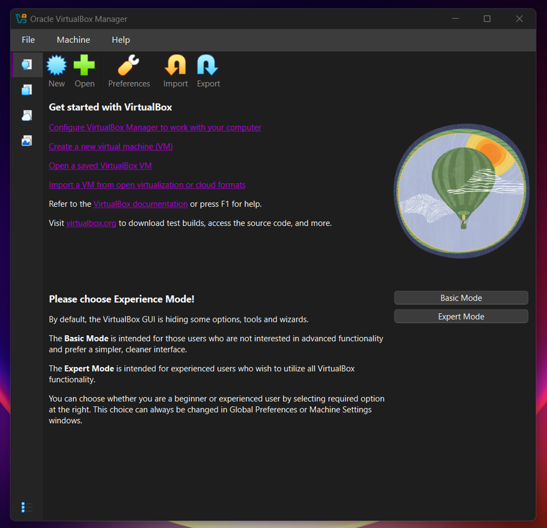
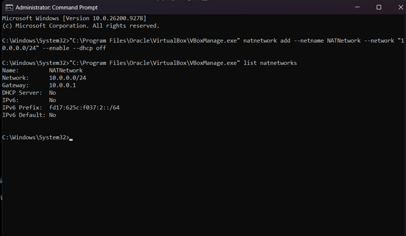
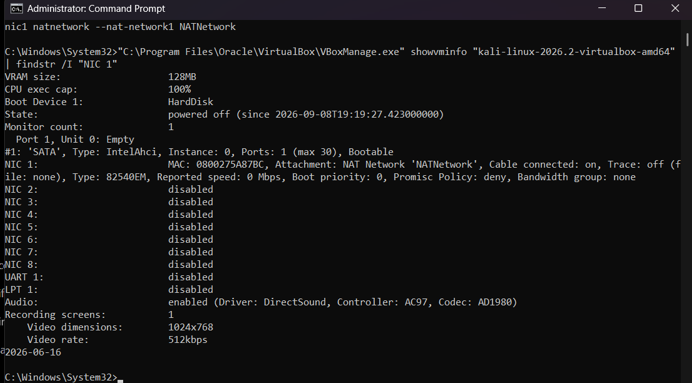
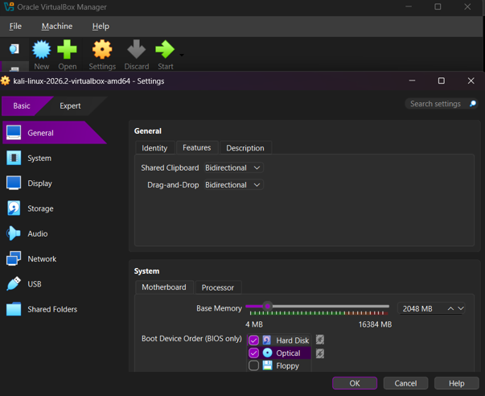
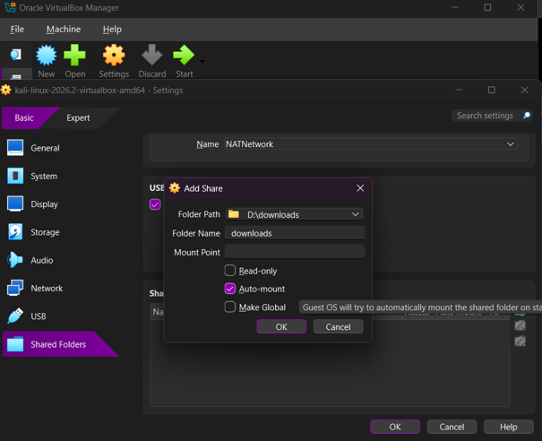
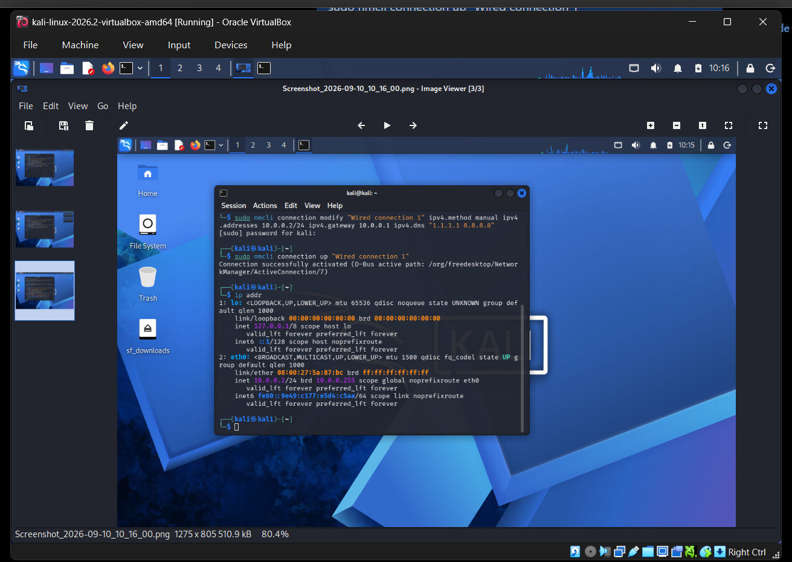
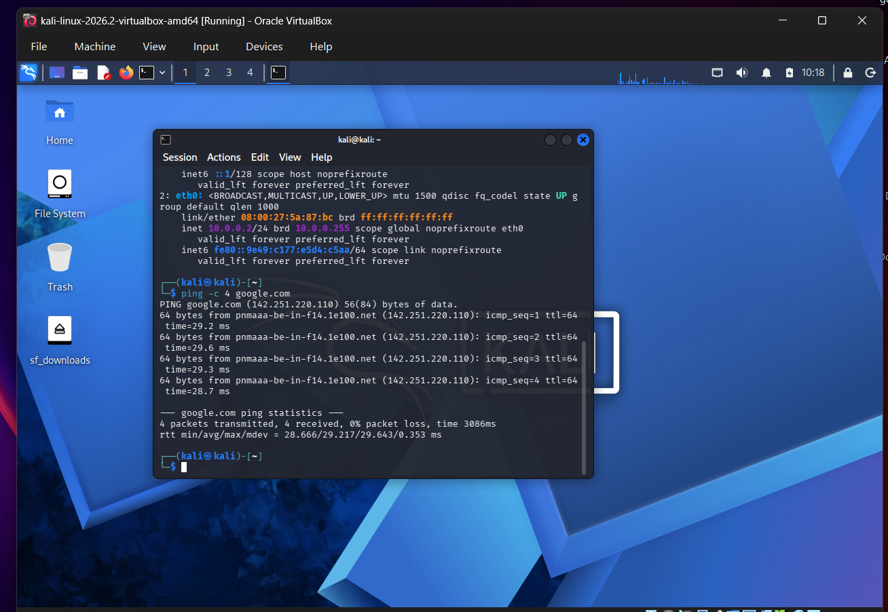
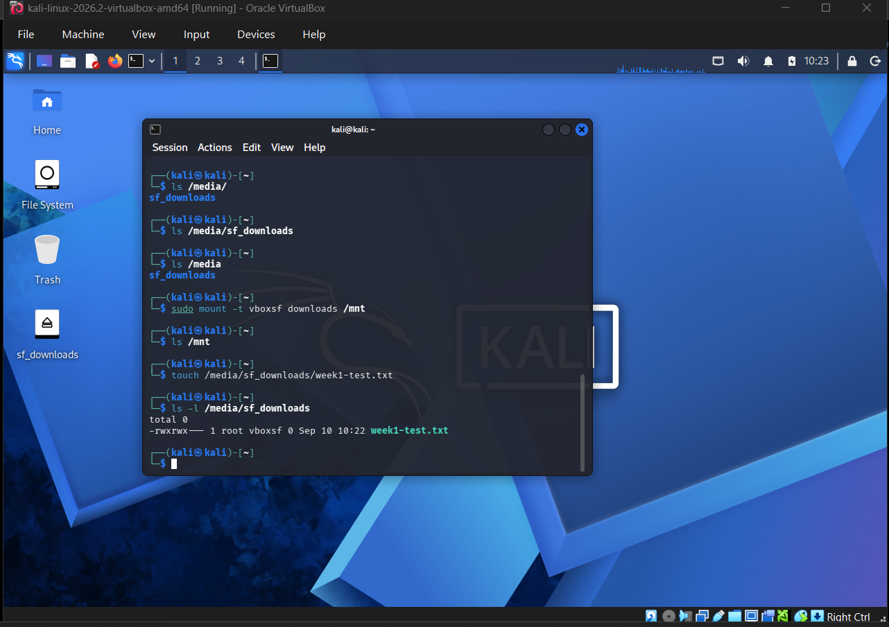
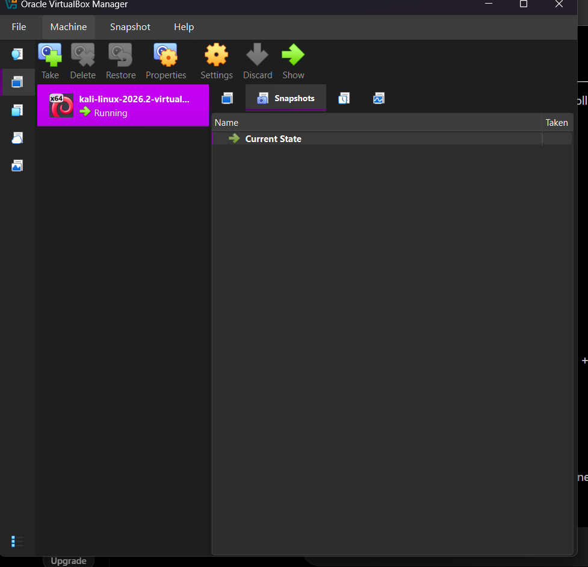

# Networkwalks Cybersecurity Internship – Week 1

## Cybersecurity Lab Environment Setup

### 1. Introduction

As part of Week 1 of the Networkwalks Cybersecurity Internship, I set up a practical cybersecurity testing laboratory using Oracle VirtualBox and Kali Linux.

The purpose of this lab was to create an isolated and controlled environment for performing cybersecurity learning and testing activities.

The lab environment includes a Kali Linux virtual machine connected to a custom NAT Network, configured with a static IP address, Internet connectivity, shared folders, clipboard and drag-and-drop functionality, and a VM snapshot for recovery.

All activities were performed for authorized educational and internship purposes only.

---

## 2. Objectives

The main objectives of this task were:

- Install and configure Oracle VirtualBox
- Create a custom NAT Network
- Import and configure Kali Linux
- Connect Kali Linux to the NAT Network
- Configure Clipboard and Drag-and-Drop
- Configure a shared folder between Windows and Kali Linux
- Assign the required static IP address to Kali Linux
- Verify Internet connectivity
- Verify shared folder functionality
- Create a snapshot of the completed lab environment

---

## 3. Lab Environment

### Host Machine

- Operating System: Windows
- Virtualization Platform: Oracle VirtualBox

### Virtual Machine

- Operating System: Kali Linux
- Network Interface: eth0

### Network Configuration

- Network Type: NAT Network
- Network Name: NATNetwork
- Network Range: 10.0.0.0/24
- Gateway: 10.0.0.1
- Kali Linux IP Address: 10.0.0.2/24

### Shared Folder

- Host Folder: `D:\downloads`
- Shared Folder Name: `downloads`
- Auto-mount: Enabled

---

## 4. Oracle VirtualBox Setup

Oracle VirtualBox was installed on the Windows host machine to create and manage the virtual cybersecurity lab.

A pre-built Kali Linux VirtualBox image was imported into VirtualBox and configured as the attacking/testing machine for the lab.

### Screenshot 1 – VirtualBox Installation / Kali Linux VM

---

## 5. NAT Network Configuration

A custom NAT Network named `NATNetwork` was created for the cybersecurity lab environment.

The network was configured using the `10.0.0.0/24` subnet with the gateway `10.0.0.1`.

This configuration provides a controlled virtual network environment for the lab machines.

### Screenshot 2 – NAT Network Configuration

---

## 6. Connecting Kali Linux to the NAT Network

The Kali Linux virtual machine was configured to use the custom `NATNetwork`.

This allows Kali Linux to communicate through the configured virtual network while maintaining the required lab network structure.

### Screenshot 3 – Kali Linux Connected to NATNetwork

---

## 7. Clipboard and Drag-and-Drop Configuration

VirtualBox Guest Settings were configured to allow communication between the Windows host and Kali Linux virtual machine.

The following settings were enabled:

- Shared Clipboard: Bidirectional
- Drag'n'Drop: Bidirectional

These settings make it easier to transfer text and files between the host and the virtual machine during lab activities.

### Screenshot 4 – Clipboard and Drag-and-Drop Configuration

---

## 8. Shared Folder Configuration

A shared folder was configured between the Windows host and Kali Linux.

The host folder was configured as:

`D:\downloads`

The VirtualBox shared folder name was:

`downloads`

Auto-mount was enabled so that the shared folder could be accessed from within Kali Linux.

### Screenshot 5 – Shared Folder Configuration

---

## 9. Kali Linux IP Configuration

Kali Linux was configured with the required static IPv4 address:

- IP Address: `10.0.0.2/24`
- Gateway: `10.0.0.1`

The network configuration was applied using NetworkManager and the connection was successfully activated.

The IP address was then verified from within Kali Linux.

### Screenshot 6 – Kali Linux IP Address Verification

---

## 10. Internet Connectivity Test

After configuring the static IP address and NAT Network, Internet connectivity was tested from Kali Linux.

A connectivity test to `google.com` was performed and successful responses were received.

This confirmed that the Kali Linux virtual machine had working Internet access through the configured NAT Network.

### Screenshot 7 – Internet Connectivity Verification

---

## 11. Shared Folder Verification

The configured VirtualBox shared folder was verified from inside Kali Linux.

The shared folder was accessible through:

`/media/sf_downloads`

A test file named `week1-test.txt` was created inside the shared folder to confirm that the folder was working correctly and allowed file operations.

### Screenshot 8 – Shared Folder Working

---

## 12. Virtual Machine Snapshot

After completing the lab configuration and verification, a VirtualBox snapshot was created.

The snapshot was named:

`Week1-Lab-Complete`

This provides a restore point for the completed Week 1 environment and allows the lab to be reverted if future testing causes configuration issues.

### Screenshot 9 – Completed Lab Snapshot

---

## 13. Troubleshooting

During the setup process, several configuration issues were encountered and resolved.

### NAT Network Not Visible in VirtualBox GUI

The required NAT Network option was not initially available in the VirtualBox network adapter dropdown.

The NAT Network was therefore verified and the Kali Linux virtual machine was connected to it using VirtualBox management tools.

### Kali Linux Initially Had No IPv4 Address

After starting Kali Linux, the network interface was active but did not initially have an IPv4 address.

The NetworkManager connection was configured with the required static IPv4 address, gateway, and DNS settings.

After reconnecting the network interface, Kali Linux successfully received the required address.

### Shared Folder Verification

The shared folder was configured and mounted successfully.

A test file was created inside the shared folder to verify that file operations were working correctly between the host and Kali Linux.

---

## 14. What I Learned

Through this practical lab, I gained hands-on experience with:

- Virtual machine deployment using Oracle VirtualBox
- NAT Network configuration
- Virtual machine network adapters
- Static IPv4 configuration
- NetworkManager in Kali Linux
- Gateway and DNS configuration
- Internet connectivity testing
- VirtualBox shared folders
- Clipboard and Drag-and-Drop configuration
- Virtual machine snapshots
- Basic troubleshooting of virtual networking

The task also helped me understand how to build a controlled cybersecurity laboratory that can be used for future authorized security testing and practical learning.

---

## 15. Final Lab Status

The Week 1 cybersecurity lab was successfully configured with the following components:

| Component | Status |
|---|---|
| Oracle VirtualBox | Completed |
| Kali Linux VM | Completed |
| NAT Network | Configured |
| Kali Linux Network | Configured |
| Static IP | Configured |
| Internet Connectivity | Verified |
| Clipboard | Enabled |
| Drag-and-Drop | Enabled |
| Shared Folder | Verified |
| VM Snapshot | Created |

---

## 16. Conclusion

The Week 1 cybersecurity laboratory environment was successfully established using Oracle VirtualBox and Kali Linux.

The final environment provides a controlled virtual setup with network connectivity, file sharing, host-to-VM interaction, and a recovery snapshot.

This lab will serve as the foundation for upcoming practical cybersecurity tasks during the internship.

---

## Disclaimer

This laboratory environment and all cybersecurity activities documented in this repository are intended strictly for authorized educational, research, and internship purposes.

No unauthorized systems, networks, or devices should be tested using these techniques.
